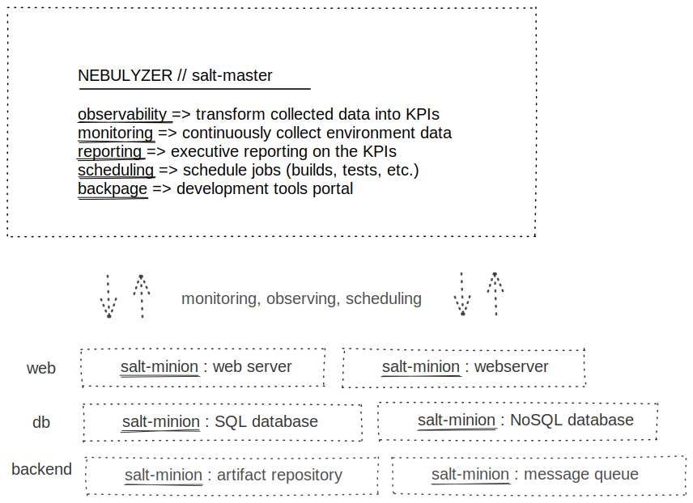

# nebulyzer
An **Observability** & **Reporting** platform.

Measure the performance of your *Solution Architecture*. How **effective** is your solution at **solving** the problem?

Measure the effectiveness of your *Cloud Architecture*. Measure the **availability** and **resilience** of the cloud in **delivering** the solution.

Measure adherence to **compliance** by both the *Solution* and *Cloud Architecture*.

## Core Ideas

- For **_client-facing_** applications and services, consider simply using **_App Engine_** for all of its benefits OOTB.
- Monitoring, observing, and reporting will be **_lazily loaded_** as **_Cloud Run_** containers as a means to be as cost-efficient as possible (experiment!@!).
  - Components are spun up and utilized only when they're needed to **_execute_**.
  - **_Cloud Run_** is just painless Docker **_container management_**.
- As a general rule of thumb, for **_CPU-intensive_** workloads, **_compute_** instances should be procured with appropriate **_scaling groups_**; otherwise utilize **_cloud_** / **_lambda_** / **_serverless_** functions.
- Lazily load services that aren't **_CPU-intensive_** whenever possible. 

## Architecture

The projects and potential relationships between **_nebulyzer_** and an example architecture are defined in the diagram below.

